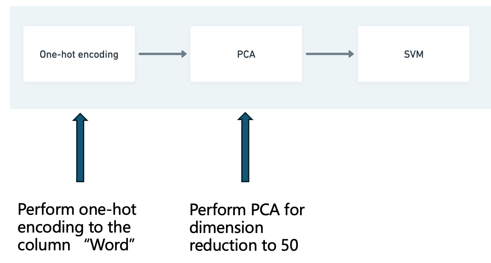
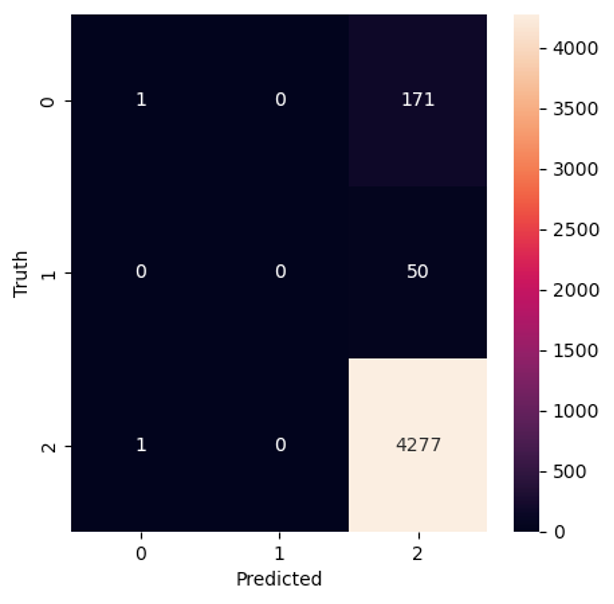
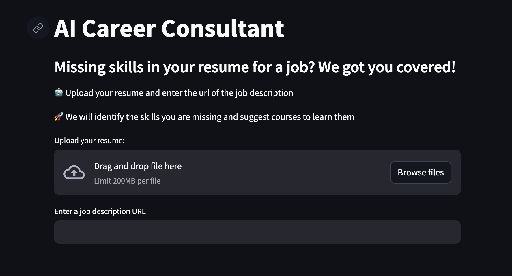
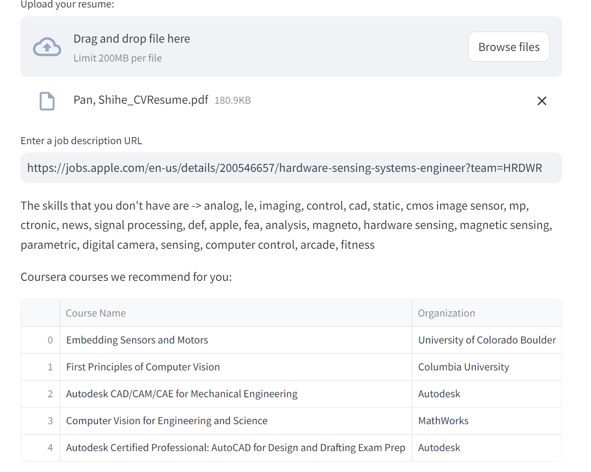
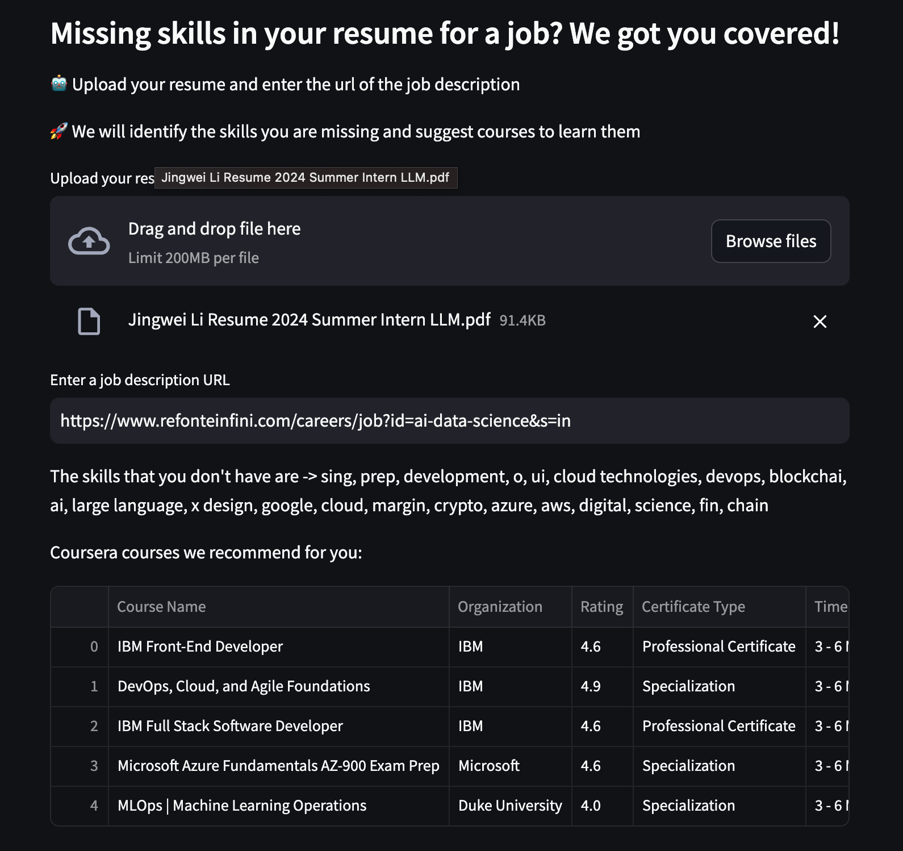

# AI-career-consultant

## Purpose
This project is going to help user get their dreamed jobs. Users are allowed to upload their resumes in pdf format as well as a job description link (url). The system would automatically detect the skills that the user is still missing for this job position and based on that, relevant Coursera courses would be recommended to the user.

## Usage:
I provide two ways using this service:
- local: see the prepare section below to run the application locally
- online: go to the following link: https://ai-career-consultant.streamlit.app/

## Prepare
### Environment Requirements
- Python 3.8+
- Required dependencies (see requirements.txt)

### Installation Steps
After you fork and git clone the project, You should do the following steps:
1. Create a virtual environment and activate it:
```bash
python -m venv venv
```
```bash
source venv/bin/activate
```
2. Install the required dependencies:
```bash
pip install -r requirements.txt
```
3. Run the application in the root folder:
```bash
streamlit run app.py
```

## System design


## Data Collection and Preprocessing
- Resume data:
    - Original data was collected on Kaggle: https://www.kaggle.com/datasets/dataturks/resume-entities-for-ner
    - Data was processed into IOB format for the Named entity recognition (NER) task. Final data looks like:
    
    where each word is tagged with either B-Skill or I-Skill or O.
    - Orginal data contains 161 resumes' contents with vairous text lengths. In terms of word labels, the final data contains 102058 O, 4315 B-Skill and 968 I-Skill.
    - data can be find in the data folder: `data/dataset.csv`
- Coursera data:
    - Original data was collected on Kaggle: https://www.kaggle.com/datasets/elvinrustam/coursera-dataset
    - Basic EDA was done to understand the data. Features such course_name, course_organization, course_rating, course_Certificate_type, course_time, course_skills, course_URL are used for recommendation.
    - The data contains 1000 courses and 865 was left after cleaning.
    - data can be find in the data folder: `data/coursera_courses.csv`

## Modeling Approach
### Machine learning - SVM
I use SVM to detect the skills. One-hot encoding on the words is done first and PCS was done afterwards to reduce the dimensionality. 



**Trained SVM result**
1. F1 score: 0.06
2. Confusion Matrix:



### Deep learning - BERT
We use the Bert model to detect the skills inside resume texts. The model is trained on the resume data with the IOB format. Tokens such as [CLS] and [SEP] are added, padding is enabled. Model config:
```
MAX_LEN = 512
TRAIN_BATCH_SIZE = 4
VALID_BATCH_SIZE = 2
EPOCHS = 6
LEARNING_RATE = 1e-05
MAX_GRAD_NORM = 10
```

**Trained Bert Model result**
1. F1 score: 0.7
2. Confusion Matrix:


Considering the unbaised dataset for NER tasks, the model performance is acceptable.

## User interface


### UI:


### Sample usecases:



## Appendix:
YouTube video: https://youtu.be/4_i_6WYygUw

